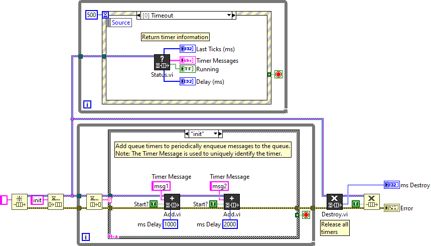

# LabVIEW Queue Timer
 Periodically enqueue messages to a queue.

[API Reference](docs/api/queuetimer.md)

## Getting Started

Open and run the `src/Example.vi` to see how to use this queue timer.

Timers are added to a queue to periodically enqueue messages. Use the `Start Stop.vi` and `Status.vi` to update or return information about the queue timers.

When the destination queue reference is closed, the queue timers are automatically destroyed. To ensure all references close properly, use the `Destroy.vi` before releasing the queue reference.

*Note: Queue timers are uniquely identified by the `<Queue>+<Timer_Message>`. The same timer message cannot be used for multiple queue timers. Instead, create unique timer messages that call the same case to periodically enqueue different rates and execute the same task.*

## Overview

In most applications, timers are need to execute one or more periodic tasks, for example read data from an instrument or update a display. LabVIEW's built-in queue methods lack the ability to force periodic messages, and event structures in a Queue Message Handler (QMH) only allow for one timeout case. This library creates one or more timers to send periodic messages to a string queue.

When a timer is created, a daemon thread is launched to handle the periodic messaging. Use the top-level API VIs to set the delay, start/stop and return the status of timers.

All queue timers are cached in memory, use the `List.vi` to return all timers within the application (grouped by queue reference).

## Jitter and Drift

Under the hood, this library calculates the time between messages using the ms tick counts and the dequeue timeout. To avoid jitter, the daemon thread also adjusts for the timing overhead to enqueue and update the status data value reference (up to 10ms). The overhead delta time is then subtracted from the next wait time.

Depending on the operating system (Windows, Linux, or Real-Time) the timer may not run determinsticly (CPU dependent) which can add to the jitter, causing 1+ ms variance between enqueued messages; attempting to avoid innevitable drift. 

*Note: The ms tick counter is returned in the `Status.vi` to perform your own jitter and drift adjustments when executing the timer message.*
