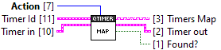

# QueueTimer

## Examples

### QueueTimer.lvlib : Example.vi

Open and run the `Example.vi` to see how to use this queue timer library.

Refer to the block diagram labels for more information.

## VI Tree

Queue timer library contains the following:
- <b>Examples</b> - Example VIs
- <b>API</b> - Top-level VIs
- <b>SubVIs</b> - Low-level VIs

**Examples**

**API**

**SubVIs**

## VI Descriptions

**API**

---

### QueueTimer.lvlib : Add.vi

Add or update a queue timer. Specify the **Timer Message** to enqueue at every **ms Delay** if **Start?** is True. The **Method** and **Timer Message** cannot be changed once the timer is created. Recreate the timer to reset the message and method.

Use the **List.vi** to list all queue timers in memory. Use the **Status.vi** to return information about the queue timers associated with this queue.

Note: Queue timers are uniquely identified by the `<queue>+<timer_message>`, the same timer message cannot be used for multiple timers. Instead, create unique messages for each timer that call the same case structure.

| Method | Description |
| --- | --- |
| Back | Enqueue to back (last out) |
| Front | Enqueue to front (first out) |
| Lossy | Enqueue to back, drop front if queue is full |
| Absent | Enqueue to back only if the element does not exist on the queue (Default) |

### QueueTimer.lvlib : Destroy.vi

Destroys all queue timers associated with the **Queue** reference and stops the daemon threads. Specify the **ms Timeout** to wait for the daemon thread to close.

Note: The Wait on Async is used which hardcodes the timeout values, supported timeout values are 0ms (No wait), 500ms, 2000ms and 5000ms.

### QueueTimer.lvlib : List.vi

List all queue timers in memory. This groups the queue timers by queue reference.

### QueueTimer.lvlib : Remove.vi

Remove a queue timer. This stops the timer and waits for the daemon to close.

Note: The Wait on Async timeout is hardcoded that supports to following timout values: 0ms (No wait), 500ms, 2000ms and 5000ms.

### QueueTimer.lvlib : Start Stop All.vi

Start or stop all queue timers associated with the **Queue** reference. The **Timer Message** are returned that were started or stopped.

### QueueTimer.lvlib : Start Stop.vi

Start or stop a specific queue timer specified by the **Timer Message**. Optionally, specify the **ms Delay** to update the periodic delay to enqueue (-1=No change).

Note: Queue timers are uniquely identified by the `<queue>+<timer_message>`.

### QueueTimer.lvlib : Status.vi

Return the status and last enqueued ms tick counts of all queue timers associated with the **Queue** reference.

**SubVIs**

---

### QueueTimer.lvlib : Daemon.vi

Daemon thread that controls the periodic messaging.

### QueueTimer.lvlib : Enqueue.vi

Enqueue **Element** to **Queue**.

| Method | Description |
| --- | --- |
| Back | Enqueue to back (last out) |
| Front | Enqueue to front (first out) |
| Lossy | Enqueue to back, drop front if queue is full |
| Absent | Enqueue to back only if the element does not exist on the queue (Default) |

### QueueTimer.lvlib : Map.vi

Queue timer in memory cache. Queue timers are identified by `<queue>+<timer_message>`.

Note: Timer messages must be unique.

**TypeDefs**

---

### QueueTimer.lvlib : Timer.ctl

Timer information.
- **Delay** - Timer periodic delay in milliseconds
- **Start** - Timer is running.
- **Ticks** - Time in ms tick counts of the last enqueue.

